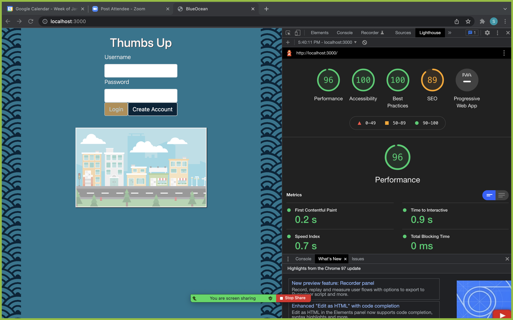

# Overview
Thumbs Up is a fullstack web application for connecting riders with drivers in their area. Drivers are able to plan trips and approve or decline requests from riders to join. Riders are able to search for nearby trips and request a seat.
The goal of Thumbs Up is to provide rides to those without access and reduce fuel costs, carbon emissions, and traffic through carpooling.

---

## Installation
**Make sure your system meets the requirements below before following installation**
1. Clone this repo to your local machine:
    - `git clone https://github.com/sterlingmuller/ThumbsUp.git`
2. Navigate to the repo's root directory:
    - `cd ThumbsUp`
3. Install project dependencies:
    - `npm i`
4. For local development, set up a local [PostgreSQL](https://www.postgresql.org/docs/) database.
    - After your local database is available, create a `.env` file in the root directory containing your local database info.
    - Uncomment lines inside section titled **"for development purposes only"** in the `backend/database/schema.sql` file.
    - Run `psql -d blueocean -f ./backend/database/schema.sql` in the root directory of the project to create the project's database and load test data.
5. Run `npm run build-dev` to build `dist/bundle.js`.
6. Run `npm run start-dev` to start development server at `localhost:3000`.

### Requirements
1. Install the following on your system (if not done already):
    - [Node.js and npm](https://nodejs.org/en/download/)
    - [PostgreSQL](https://www.postgresql.org/download/)
2. Obtain a [Google Maps API key](https://developers.google.com/maps)
3. Allow your browser to access your location

---

## Usage
This application has been deployed on heroku: https://thumbsup-sterling.herokuapp.com/

- **Sample Driver:**
    - Username: MrFripple
    - Password: 123
-  **Sample Rider:**
    - Username: FryGuy
    - Password: 456

### Sign-in as Driver, add new trip

### Sign-in as Rider, search for new trip

### As driver, approve ride request and send message

### As rider, view completed trips and rate driver

---

## Performance

## Authors
Thumbs Up was written by [Sterling Muller](https://github.com/sterlingmuller), [Mitchell Gardner](https://github.com/Mitch311G), [Prith Jaganathan](https://github.com/prith98), [Matt Dziedzic](https://github.com/MrFripple), [Neil Mosser](https://github.com/NeilMosser), and [Ezra Pullido](https://github.com/ezra-pullido).
